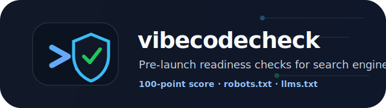
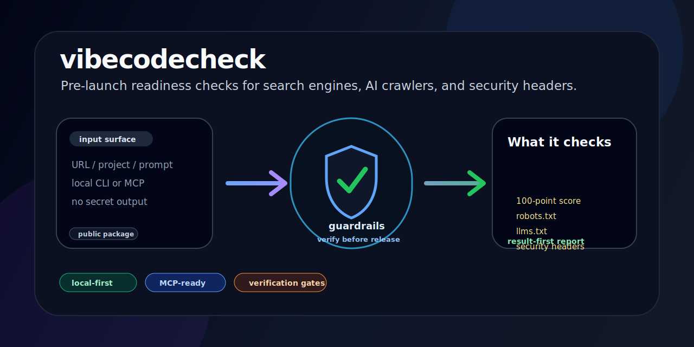

<p align="center">
  
</p>

<p align="center">
  <a href="https://www.npmjs.com/package/@veris.works/vibecodecheck"></a>
  <a href="https://nodejs.org"></a>
  <a href="https://modelcontextprotocol.io"></a>
  <a href="LICENSE"></a>
</p>

<p align="center">
  <a href="README.ko.md">한국어</a> ·
  <a href="#usage">Usage</a> ·
  <a href="#what-it-checks">What it checks</a> ·
  <a href="#security-boundary">Security boundary</a>
</p>

<p align="center">
  
</p>

# vibecodecheck

**Vibe-coded MVPs ship fast. Search engines and AI crawlers still need robots.txt, llms.txt, sitemap, security headers, and correct bot policies.**

`vibecodecheck` scans a public URL for launch blockers across search, AI crawler access, answer-engine files, and safety boundaries.

> One command. Structured evidence. Safer agent and launch workflows.

---

## One-line result

```text
vibecodecheck = pre-launch readiness check for search engines + AI crawlers + security
```

## Why this exists

Every MVP goes through the same painful cycle:

```text
Problem                               What breaks
robots.txt missing Sitemap directive  Bing misses your content
HEAD / returns 405                    Bing crawler stops indexing
llms.txt missing                      Claude, ChatGPT cannot cite your content
GPTBot blocked                        ChatGPT never learns your site exists
.env exposed at /.env                 Credentials leak to anyone who looks
security.txt missing                  Security researchers cannot contact you
```

These are not hard to fix — but they are invisible until something breaks. `vibecodecheck` catches them before launch.

## What it checks

```text
Category               Checks                                            Max Score
─────────────────────────────────────────────────────────────────────────────────
Discoverability        robots.txt, sitemap.xml, RSS/Atom feed               25
AI Crawler Access      13 crawler user agents: ClaudeBot, GPTBot,           25
                       ChatGPT-User, OAI-SearchBot, PerplexityBot,
                       Google-Extended, GrokBot, BraveBot, Amazonbot,
                       Bytespider, cohere-ai, meta-externalagent, Applebot
Answer Engine          llms.txt, llms-full.txt, Schema.org JSON-LD,         20
Content                AEO schema types, og:title, og:description
Technical SEO          HTTPS, HEAD compatibility (Bing), security           15
                       headers, title/description, canonical, viewport,
                       og:image, twitter:card, noindex detection
Safety Boundary        .env, .git/config, /admin, /graphql, OpenAPI/Swagger 15
                       exposure checks, bundle secret scan, security.txt
─────────────────────────────────────────────────────────────────────────────────
Total                                                                       100
```

## Usage

### CLI

```bash
npx --yes --package=@veris.works/vibecodecheck vibecodecheck https://your-mvp.com
```

```bash
# Save markdown report
npx --yes --package=@veris.works/vibecodecheck vibecodecheck https://your-mvp.com --md

# Save to specific file
npx --yes --package=@veris.works/vibecodecheck vibecodecheck https://your-mvp.com --out=report.md

# JSON output (for CI pipelines)
npx --yes --package=@veris.works/vibecodecheck vibecodecheck https://your-mvp.com --json
```

Exit code `1` when score < 40 — CI-friendly gate.

### MCP — Claude Desktop

Add to `claude_desktop_config.json`:

```json
{
  "mcpServers": {
    "vibecodecheck": {
      "command": "npx",
      "args": ["--yes", "--package=@veris.works/vibecodecheck", "vibecodecheck-mcp"]
    }
  }
}
```

Then ask Claude: *"Check if my site is ready to launch"* — Claude calls `check_site(url)` and explains each finding.

### MCP — Remote / Cloud Agents (codex-hermes, etc.)

```bash
npx --yes --package=@veris.works/vibecodecheck vibecodecheck-mcp --port=3000
```

Connect any MCP-compatible agent to `http://localhost:3000`. Uses StreamableHTTP transport.

## Example output

```
  VibecodeCheck scanning https://your-mvp.com ...

  VibecodeCheck
  https://your-mvp.com

  Score: 83/100  B — mostly ready

  Discoverability          ██████████ 25/25
  AI Crawler Access        ██████████ 24/25
  Answer Engine Content    ████░░░░░░  8/20
  Technical SEO            ██████████ 15/15
  Safety Boundary          ███████░░░ 11/15

  ❌ Issues (4)
     • No Schema.org JSON-LD found
     • FAQPage schema missing
     • Article schema missing
     • security.txt not found

  ⚠️  Warnings (1)
     • llms-full.txt not found (optional)
```

## Score grades

```text
90–100   A — launch ready
75–89    B — mostly ready
60–74    C — needs work
40–59    D — significant gaps
0–39     F — not ready to launch
```

## Practical scenarios

### Before launch — catch the silent blockers

```bash
npx --yes --package=@veris.works/vibecodecheck vibecodecheck https://my-mvp.com
```

Catches missing llms.txt, blocked AI bots, no sitemap, exposed .env paths — before users or search engines notice.

### In CI — gate on score

```yaml
- name: Vibecodecheck
  run: npx --yes --package=@veris.works/vibecodecheck vibecodecheck https://staging.my-mvp.com --json
  # exits 1 if score < 40
```

### With Claude Desktop — get fix instructions

Ask Claude: *"Run vibecodecheck on https://my-mvp.com and tell me what to fix first."*

Claude runs the audit and returns prioritized fix steps with explanations.

## Architecture

```text
vibecodecheck/
├── bin/vibecodecheck.js      ← CLI entry (npx --yes --package=@veris.works/vibecodecheck vibecodecheck)
├── mcp/server.js             ← MCP server: stdio + HTTP (npx --yes --package=@veris.works/vibecodecheck vibecodecheck-mcp)
├── src/
│   ├── audit.js              ← orchestrator (parallel Promise.allSettled)
│   ├── checks/               ← 10 independent check modules
│   │   ├── aiBots.js         ← 13 AI crawlers, UA simulation
│   │   ├── feed.js           ← RSS/Atom feed detection
│   │   ├── headers.js        ← HTTPS, HEAD, security headers
│   │   ├── llms.js           ← llms.txt + llms-full.txt
│   │   ├── robots.js         ← robots.txt + Sitemap directive
│   │   ├── schema.js         ← Schema.org JSON-LD + OG tags
│   │   ├── securityTxt.js    ← /.well-known/security.txt
│   │   ├── sensitivePaths.js ← .env, .git, /admin exposure
│   │   ├── seoMeta.js        ← title, meta description, canonical, viewport
│   │   └── sitemap.js        ← sitemap.xml / sitemap_index.xml
│   ├── reporters/
│   │   └── markdown.js       ← console + markdown output
│   └── utils/
│       └── fetch.js          ← fetchWithTimeout (10s, AbortController)
```

## Security boundary

- All fetch calls have a 10-second timeout (AbortController)
- `--out=` restricted to current directory (no path traversal)
- Localhost/private IP scans emit a warning
- No data is sent to any external service — all checks run client-side

## Requirements

Node.js 18+

## License

MIT — [veris](https://veris.kr) · [hello@veris.kr](mailto:hello@veris.kr)
